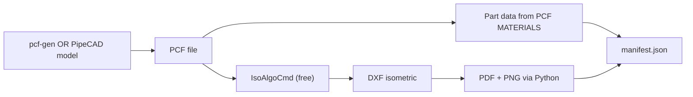

# Free Software Stack (No ISOGEN / CADWorx License)

You can build a **realistic** training funnel without paid licenses. The recommended stack uses **PipeCAD Personal Edition** (free) + **IsoAlgo** (free isometric engine) + this repo's Python tooling.

---

## Recommended free stack

| Role | Tool | Cost | Notes |
|------|------|------|-------|
| **Isometric engine** | [IsoAlgo](https://github.com/eryar/PipeCAD/releases) | Free | PCF/IDF → DXF isometric (ISOGEN-compatible data format) |
| **3D piping CAD (optional)** | [PipeCAD Personal](https://github.com/eryar/PipeCAD/releases) | Free | Model lines, export PCF, MTO list |
| **PCF generation (batch)** | `pcf-gen` (this repo, planned) | Free | Parametric dummy lines without manual CAD |
| **DXF → PDF → PNG** | Python + LibreCAD or ODA File Converter | Free | Export tiers for training |
| **Manifest / dataset** | `iso-funnel` (this repo, planned) | Free | Link PCF data ↔ image labels |

> **PipeCAD is not open source**, but the **Personal Edition is free to download and use**. IsoAlgo can also run **standalone** from the same releases page without modeling in PipeCAD.

---

## Architecture (free)



**Ground truth** = PCF `MATERIALS` section (item codes, descriptions) + component IDs.  
**Training image** = PNG raster of IsoAlgo DXF output.

This produces **real isometric-style drawings** from industry-standard PCF — not hand-drawn ezdxf mockups.

---

## Quick start on Windows (no license)

### 1. Download IsoAlgo + sample PCF

1. Go to [PipeCAD Releases](https://github.com/eryar/PipeCAD/releases)
2. Download the latest **IsoAlgo** zip (e.g. `IsoAlgo-1.0.x.zip`)
3. Extract to e.g. `C:\Tools\IsoAlgo\`
4. Find sample `SampleIso.pcf` in the package

### 2. Generate your first isometric DXF

Open **Command Prompt** in the IsoAlgo folder:

```bat
IsoAlgoCmd -o IsoAlgo.opt -p SampleIso.pcf
```

Output: `SampleIso.dxf` (piping isometric drawing)

### 3. Optional — full PipeCAD Personal (model + MTO)

Download **PipeCAD Personal** from the same releases page if you want to:

- Model dummy piping lines in 3D
- Export PCF from the model
- Generate MTO / material lists from the UI

Login for sample project (from PipeCAD docs): user `SYSTEM`, password `XXXXXX`

### 4. Convert DXF → PDF → PNG (Python)

From this repo (once `iso-funnel` is implemented):

```bat
cd C:\Users\You\Desktop\Isometric-Extractor
pip install -e .
iso-funnel export --dxf C:\Tools\IsoAlgo\SampleIso.dxf --output data\sample
```

Interim manual options:

- Open DXF in **LibreCAD** (free) → Print to PDF
- Or use **ODA File Converter** (free) for DWG/DXF batch conversion

---

## What PCF gives you (free ground truth)

PCF is plain text. Example from [Hexagon PCF Reference](https://docs.hexagonppm.com/r/en-US/PCF-Reference-Guide/Version-15/253225):

```
PIPE
    COMPONENT-IDENTIFIER 5
    END-POINT 132364.0 56421.0 11131.0 14
    MATERIAL-IDENTIFIER 2

MATERIALS
MATERIAL-IDENTIFIER 2
    ITEM-CODE N.A.-002
    DESCRIPTION 14" STD, A106 GR B, CC173
```

Our `iso-funnel` parser reads this directly — **no commercial BOM report required** for basic Item + Description training.

---

## FreeCAD — useful but not sufficient alone

| Tool | Good for | Missing for your goal |
|------|----------|------------------------|
| [FreeCAD](https://www.freecadweb.org/) + [Comfac MEP](https://github.com/Comfac-Global-Group/pipe-duct) | 3D pipe networks, BOM CSV | No ISOGEN-style isometric export |
| [OSE Piping Workbench](https://github.com/rkrenzler/ose-piping-workbench) | Fittings library | No PCF / iso export |
| LibreCAD | View/plot DXF | Not a piping design tool |

**Verdict:** Use FreeCAD if you want open-source 3D modeling practice, but route isometrics through **IsoAlgo** via PCF.

---

## Comparison: free options

| Approach | Realistic iso style | BOM ground truth | Batch scale | Effort |
|----------|--------------------|------------------|-------------|--------|
| **IsoAlgo + pcf-gen** ⭐ | High | PCF parse | High (automated) | Medium |
| **PipeCAD Personal + IsoAlgo** | High | PCF + MTO UI | Medium | Low to start |
| **FreeCAD + Comfac BOM CSV** | Low (not true iso) | CSV | Medium | High bridge work |
| **ezdxf synth-gen (current)** | Low | JSON spec | High | Done, but not realistic |

---

## Revised Phase A plan (free)

| Step | Tool | Deliverable |
|------|------|-------------|
| A1 | IsoAlgo + sample PCF | One real DXF isometric on your PC |
| A2 | `pcf-gen` | 50+ varied PCF files (dummy lines) |
| A3 | IsoAlgo batch script | 50+ DXF isometrics |
| A4 | `iso-funnel` | PCF parse → manifest + PDF + PNG |
| A5 | Verify overlays | Red=item no, green=description |

---

## Limitations to expect

1. **IsoAlgo ≠ ISOGEN** — symbol style may differ slightly from your clients' drawings; still far better than ezdxf mocks.
2. **PipeCAD docs** — partly Chinese; community QQ group for support.
3. **Callout bbox linking** — may need DWG/DXF parsing in `iso-funnel`; not all IsoAlgo styles expose BOM identically to ISOGEN.
4. **Commercial client drawings** — fine-tune later on a small set of real scans; synthetic PCF+IsoAlgo covers bulk training.

---

## Next implementation in this repo

1. **`pcf-gen`** — Python CLI to emit valid PCF for N dummy topologies
2. **`iso-funnel`** — Windows batch: PCF → IsoAlgo → DXF → PNG + `manifest.json`
3. Deprecate ezdxf `synth-gen` for production (keep for unit tests only)

**Confirm you can download IsoAlgo from GitHub** and we implement `pcf-gen` + `iso-funnel` against that path.
