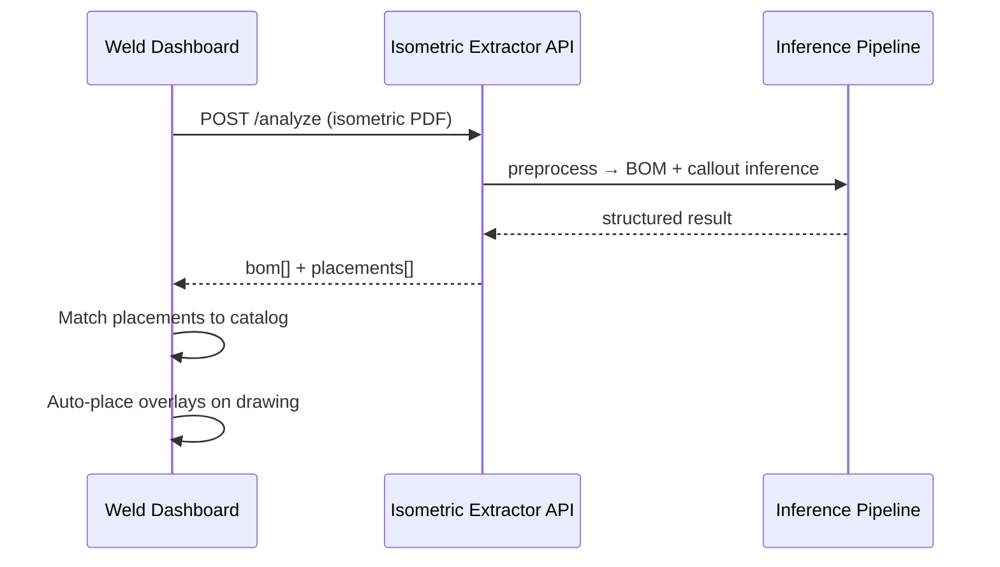

# Isometric Extractor — AI Training Funnel Plan

## Executive Summary

Build a **synthetic-data-first pipeline** that generates isometric piping drawings with known ground truth, degrades them through realistic export stages (DWG → PDF → raster image), and uses that linked dataset to train image-based models for:

1. **BOM extraction** — qty, part description, attributes, material grade
2. **Part localization** — item number callouts and positions on the drawing

The pipeline is designed to integrate with external software (e.g. Weld Dashboard) via a REST API in Phase C.

---

## Goals

### Short-term (Phase B outcome)

A model that, given a **raster image** of an isometric drawing (PNG/JPG), returns:

```json
{
  "bom": [
    {
      "itemNo": 1,
      "qty": 2,
      "description": "ELBOW 90 DEG LR",
      "attributes": { "nps": "4", "schedule": "40", "rating": "150#" },
      "materialGrade": "ASTM A234 WPB",
      "confidence": 0.96
    }
  ],
  "placements": [
    {
      "itemNo": 1,
      "position": { "x": 0.42, "y": 0.31 },
      "bbox": [820, 610, 48, 48],
      "confidence": 0.93
    }
  ]
}
```

Positions use **normalized coordinates** (0–1) so they work across resolutions.

### Long-term

- Extend to scanned legacy drawings (domain randomization in Phase A)
- Plug into Weld Dashboard for auto-overlay placement
- Active learning from user corrections in production

---

## System Architecture

```
┌─────────────────────────────────────────────────────────────────────────┐
│                         PHASE A — Data Funnel                            │
├─────────────────────────────────────────────────────────────────────────┤
│  Spec JSON  →  Draw Engine  →  DWG/DXF  →  PDF  →  Raster Image         │
│      │              │            │         │          │                │
│      └──────────────┴────────────┴─────────┴──────────┴──► manifest.json │
└─────────────────────────────────────────────────────────────────────────┘
                                    │
                                    ▼
┌─────────────────────────────────────────────────────────────────────────┐
│                         PHASE B — Training                               │
├─────────────────────────────────────────────────────────────────────────┤
│  Dataset Loader  →  Model(s)  →  Train / Val / Test  →  Metrics + CKPT  │
│       │                  │                                               │
│       │                  ├── BOM Table Model (detection + parsing)         │
│       │                  └── Callout Model (balloon + leader tip)          │
└─────────────────────────────────────────────────────────────────────────┘
                                    │
                                    ▼
┌─────────────────────────────────────────────────────────────────────────┐
│                         PHASE C — API                                    │
├─────────────────────────────────────────────────────────────────────────┤
│  POST /analyze  →  preprocess  →  inference  →  structured JSON          │
└─────────────────────────────────────────────────────────────────────────┘
```

---

## Repository Structure (target)

```
isometric-extractor/
├── docs/
│   └── PLAN.md                    # This document
├── packages/
│   ├── synth-gen/                 # Phase A — synthetic drawing generator
│   │   ├── spec/                  # JSON schema for drawing specs
│   │   ├── engine/                # DWG/DXF generation (ezdxf)
│   │   ├── export/                # PDF + raster conversion
│   │   ├── augment/               # Scan simulation, noise, skew
│   │   └── cli.py                 # `synth-gen run --count 1000`
│   ├── dataset/                   # Shared dataset format + validators
│   ├── training/                  # Phase B — train / eval scripts
│   │   ├── bom/                   # BOM table model
│   │   ├── callout/               # Part location model
│   │   └── verify/                # Verification harness
│   └── api/                       # Phase C — FastAPI service
├── data/                          # Gitignored — generated datasets
│   └── .gitkeep
├── configs/                       # Training + export configs
├── scripts/                       # Dev utilities
├── docker-compose.yml
└── README.md
```

---

## Phase A — Synthetic Training Data Funnel

### Objective

Generate **N drawings** where every pixel and text string in the final image can be traced back to structured source data.

### A.1 — Drawing Specification Schema

Each drawing starts as a `drawing-spec.json`:

```json
{
  "id": "iso_00042",
  "seed": 42,
  "sheet": { "width_mm": 420, "height_mm": 297, "title": "ISO-00042" },
  "line": { "number": "6-P-1201", "spec": "A1A", "size": "4\"" },
  "bom": [
    {
      "itemNo": 1,
      "qty": 2,
      "description": "ELBOW 90 DEG LR",
      "attributes": { "nps": "4", "schedule": "40", "endPrep": "BE" },
      "materialGrade": "ASTM A234 WPB",
      "componentType": "elbow_90_lr"
    }
  ],
  "placements": [
    {
      "itemNo": 1,
      "modelPoint": [120.5, 85.0],
      "leaderStyle": "balloon"
    }
  ],
  "routing": {
    "segments": [
      { "from": [50, 50], "to": [200, 50], "nps": "4" },
      { "from": [200, 50], "to": [200, 150], "angle": 90 }
    ]
  }
}
```

**Key principle:** The spec is the **single source of truth**. DWG, PDF, image, and labels are all derived from it.

### A.2 — Generation Pipeline (4 export tiers)

| Tier | Format | Purpose | Tooling |
|------|--------|---------|---------|
| **T0** | `drawing-spec.json` | Canonical ground truth | Internal |
| **T1** | `native.dxf` / `native.dwg` | Vector source with layers | `ezdxf` (+ ODA converter for DWG) |
| **T2** | `export.pdf` | Text-searchable vector PDF | `ezdxf` → PDF or LibreCAD/ODA batch |
| **T3** | `export.png` | Training images | `PyMuPDF` / `pdf2image` @ 150–300 DPI |

**Per-tier outputs in manifest:**

```json
{
  "id": "iso_00042",
  "files": {
    "spec": "iso_00042/spec.json",
    "dxf": "iso_00042/native.dxf",
    "pdf": "iso_00042/export.pdf",
    "image": "iso_00042/export_300dpi.png"
  },
  "bom": [ /* same as spec */ ],
  "placements": [
    {
      "itemNo": 1,
      "modelPoint": [120.5, 85.0],
      "imagePoint": [842, 615],
      "bbox": [820, 590, 44, 50],
      "balloonBbox": [800, 560, 36, 36]
    }
  ],
  "bomTableRegion": { "bbox": [2100, 50, 800, 600] },
  "transform": {
    "dpi": 300,
    "pageSize": [4961, 3508],
    "modelToImage": [[scale, 0, tx], [0, scale, ty]]
  }
}
```

### A.3 — Draw Engine (T1 generation)

Programmatic isometric drawing via `ezdxf`:

| Layer | Content |
|-------|---------|
| `PIPE` | Centerlines, isometric axes (30° projection) |
| `SYMBOLS` | Simplified blocks: elbow, tee, flange, valve, reducer |
| `BOM_TABLE` | Table grid + cell text |
| `CALLOUTS` | Leader lines, arrow tips, balloon circles, item numbers |
| `DIMS` | Optional dimension strings |
| `TITLEBLOCK` | Drawing number, revision, line number |

**Isometric projection helper:**

```
iso_x = (x - y) * cos(30°)
iso_y = (x + y) * sin(30°) - z
```

Start with a **limited symbol library** (8–12 block types) and expand later.

### A.4 — Export & Coordinate Propagation

Critical requirement: when converting T1 → T3, **propagate coordinates** so image labels match model space.

1. Record DXF extents and insertion points at generation time
2. On PDF export, store page box dimensions
3. On rasterization, apply same affine transform to all ground-truth points
4. Validate: render bounding boxes on image → visual QA script flags drift

### A.5 — Domain Randomization (degradation)

Apply configurable augmentations when producing T3 images to improve real-world robustness:

| Augmentation | Parameters | Simulates |
|--------------|------------|-----------|
| DPI variance | 150–400 | Scan quality |
| Gaussian noise | σ 2–8 | Scanner grain |
| Skew / rotation | ±2° | Feed misalignment |
| JPEG compression | Q 60–95 | Email attachments |
| Gaussian blur | σ 0–1.5 | Out-of-focus scan |
| Brightness / contrast | ±15% | Faded prints |
| Font substitution | 2–3 ISO fonts | Client template variance |
| Line weight jitter | ±0.05 mm | Plotter differences |
| Partial occlusion | 0–5% | Stamps, markups |

**Rule:** Store both `clean/` and `augmented/` image variants with the **same** logical ground truth (positions may need re-computation after geometric transforms).

### A.6 — Label Formats for Training

Generate parallel label files from each manifest:

| Task | Format | Contents |
|------|--------|----------|
| BOM table detection | COCO JSON | `bom_table` bounding box |
| BOM cell OCR | Custom JSON | Cell bboxes + text per field |
| Callout detection | COCO / YOLO | `balloon`, `arrow_tip` classes |
| Item number OCR | Text + bbox | Digit string at balloon |
| Full structured | JSONL | One row per image with complete BOM + placements |

### A.7 — Phase A Deliverables

| Deliverable | Acceptance criteria |
|-------------|---------------------|
| `synth-gen` CLI | `synth-gen run --count 1000 --output data/v1` |
| Spec schema + validator | JSON Schema, fails on invalid specs |
| DXF generator | Produces valid DXF openable in AutoCAD / LibreCAD |
| PDF + PNG export | Batch conversion with coordinate manifest |
| Augmentation pipeline | Config-driven; reproducible via seed |
| Visual QA tool | `synth-gen verify --sample 50` overlays bboxes on images |
| Dataset stats report | Class distribution, BOM row counts, symbol counts |

### A.8 — Phase A Dataset Targets

| Milestone | Drawings | Images (with aug) | Purpose |
|-----------|----------|-------------------|---------|
| Smoke test | 50 | 200 | Pipeline validation |
| Alpha dataset | 1,000 | 5,000 | First model experiments |
| Beta dataset | 5,000 | 25,000 | Serious training |
| Production dataset | 20,000+ | 100,000+ | Robust generalization |

---

## Phase B — Model Training

### Objective

Train image-based models using Phase A manifests. Two complementary models in v1 (can merge later).

### B.1 — Model A: BOM Table Extractor

**Input:** Full drawing image (or cropped sheet)  
**Output:** Structured BOM rows

**Architecture options (evaluate in order):**

| Option | Pros | Cons |
|--------|------|------|
| **A1. Detect + OCR** (YOLO crop → PaddleOCR / TrOCR per cell) | Interpretable, fast | Two-stage errors |
| **A2. Table Transformer** (TATR) | Good on tables | Needs table region crop |
| **A3. Donut / Nougat fine-tuned** | End-to-end text | Harder to debug |
| **A4. VLM (Qwen2-VL, etc.)** | Fast to prototype | Cost, latency at scale |

**Recommended v1:** **A1** — detect BOM table region, parse rows/columns with rules + OCR, then field classifier for material vs description.

**BOM field parsing (post-OCR):**

```
Raw row: "2 | ELBOW 90 DEG LR 4\" SCH 40 | A234 WPB"
         ↓
{ qty: 2, description: "ELBOW 90 DEG LR", nps: "4", schedule: "40", materialGrade: "A234 WPB" }
```

Use regex + small NER model trained on synthetic descriptions.

### B.2 — Model B: Callout / Part Locator

**Input:** Full drawing image  
**Output:** Per-item `{ itemNo, bbox, tipPoint, confidence }`

**Architecture:**

1. **Balloon detector** — YOLOv8/v11, classes: `balloon`, `arrow_tip`
2. **Digit OCR** — crop balloon region → TrOCR (item number)
3. **Association** — match OCR number to BOM `itemNo`

Optional: keypoint model for arrow tip if leader is long/deformed.

### B.3 — Dataset Splits

| Split | Ratio | Rule |
|-------|-------|------|
| Train | 80% | Random by `drawing id` |
| Val | 10% | Held-out specs (new routing patterns) |
| Test | 10% | Held-out specs + held-out augmentation profiles |

**Never split by augmentation variant of the same drawing** — leakage risk.

### B.4 — Training Infrastructure

| Component | Choice |
|-----------|--------|
| Framework | PyTorch |
| Detection | Ultralytics YOLO or MMDetection |
| OCR | PaddleOCR / TrOCR |
| Experiment tracking | MLflow or Weights & Biases |
| Config | Hydra or YAML per experiment |
| Compute | 1× A100 or RTX 4090 for v1 |

### B.5 — Metrics & Verification

#### BOM extraction

| Metric | Target (synthetic test) | Target (real drawings) |
|--------|----------------------|------------------------|
| Table detection recall | ≥ 99% | ≥ 95% |
| Row count accuracy | ≥ 98% | ≥ 90% |
| Field accuracy (qty, description, material) | ≥ 97% per field | ≥ 85% |
| End-to-end BOM match (exact row) | ≥ 95% | ≥ 80% |

#### Callout localization

| Metric | Target (synthetic) | Target (real) |
|--------|-------------------|---------------|
| Balloon detection mAP@50 | ≥ 0.95 | ≥ 0.85 |
| Item number OCR accuracy | ≥ 98% | ≥ 92% |
| Tip localization error (px @ 300dpi) | ≤ 15 px | ≤ 25 px |
| Item-to-BOM association accuracy | ≥ 97% | ≥ 90% |

#### Verification harness (`training/verify/`)

```bash
# Run full eval suite on a checkpoint
python -m training.verify.run \
  --checkpoint checkpoints/bom_v1.pt \
  --dataset data/v1/test \
  --report reports/eval_v1.json

# Visual report: overlay predictions on images
python -m training.verify.visualize \
  --report reports/eval_v1.json \
  --output reports/figures/
```

Outputs:
- Per-field confusion matrices
- Worst-case image gallery
- Regression diff vs previous checkpoint
- JSON report for CI gate (fail if metrics drop > 2%)

### B.6 — Phase B Deliverables

| Deliverable | Description |
|-------------|-------------|
| `training/bom/train.py` | BOM model training script |
| `training/callout/train.py` | Callout model training script |
| `training/verify/` | Eval + visualization + CI gate |
| `configs/` | Reproducible experiment configs |
| Trained checkpoints | Versioned in object storage (not git) |
| Model card | Accuracy, limitations, training data version |

---

## Phase C — Inference API

### Objective

HTTP API callable from Weld Dashboard or any external system.

### C.1 — API Design

**Base URL:** `https://extractor.example.com/v1`

#### `POST /analyze`

**Request:**

```
Content-Type: multipart/form-data

file: <image/png|jpg|pdf>
options: {
  "tasks": ["bom", "placements"],
  "dpi": 300,
  "catalogId": "optional-for-reconciliation"
}
```

**Response:**

```json
{
  "id": "req_abc123",
  "status": "completed",
  "drawing": { "width": 4961, "height": 3508, "dpi": 300 },
  "bom": [ /* ... */ ],
  "placements": [ /* ... */ ],
  "meta": {
    "modelVersion": "bom_v1.2+callout_v1.1",
    "inferenceMs": 1240,
    "reviewRecommended": false
  }
}
```

#### `GET /health`

Liveness + model version.

#### `POST /analyze/batch` (optional v2)

Queue multiple files; poll for results.

### C.2 — Service Stack

| Layer | Choice |
|-------|--------|
| API framework | FastAPI |
| Image preprocess | OpenCV, PyMuPDF (PDF → image) |
| Inference | ONNX Runtime or TorchServe |
| Queue (batch) | Redis + Celery or ARQ |
| Container | Docker + GPU optional |
| Auth | API key header (`X-API-Key`) |

### C.3 — Deployment Modes

| Mode | Use case |
|------|----------|
| **Local Docker** | On-prem / air-gapped fab shops |
| **Cloud GPU** | Hosted SaaS |
| **Edge CPU** | ONNX-quantized models, slower but no GPU |

### C.4 — Integration with Weld Dashboard



Weld Dashboard retains **catalog reconciliation** and **user review UI**; this service owns **vision extraction only**.

### C.5 — Phase C Deliverables

| Deliverable | Description |
|-------------|-------------|
| FastAPI app | `packages/api/` |
| Docker image | `docker compose up api` |
| OpenAPI spec | Auto-generated at `/docs` |
| Python + JS client stubs | Optional SDK |
| Integration guide | For Weld Dashboard team |

---

## Implementation Timeline

Technical phases only — no calendar estimates.

| Phase | Work packages | Depends on |
|-------|---------------|------------|
| **A0** | Spec schema, project scaffold, CI | — |
| **A1** | DXF draw engine (pipe + BOM table + callouts) | A0 |
| **A2** | PDF + PNG export with coordinate manifest | A1 |
| **A3** | Augmentation + label exporters (COCO, JSONL) | A2 |
| **A4** | Visual QA + generate 1k smoke dataset | A3 |
| **B0** | Dataset loader + baseline metrics | A4 |
| **B1** | BOM table model v1 | B0 |
| **B2** | Callout locator model v1 | B0 |
| **B3** | Verification harness + model card | B1, B2 |
| **C0** | FastAPI wrapper + Docker | B3 |
| **C1** | Weld Dashboard integration test | C0 |

---

## Technology Stack Summary

| Area | Primary | Alternatives |
|------|---------|--------------|
| Drawing generation | `ezdxf` | FreeCAD scripting, Blender |
| DWG output | ODA File Converter | LibreDWG |
| PDF export | `ezdxf` PDF backend, reportlab | ODA, LibreCAD CLI |
| Rasterization | `PyMuPDF`, `pdf2image` | ImageMagick |
| Detection | Ultralytics YOLO11 | RT-DETR, MMDet |
| OCR | PaddleOCR, TrOCR | Tesseract (baseline only) |
| API | FastAPI | Flask |
| Training tracking | MLflow | W&B |

---

## Risks & Mitigations

| Risk | Impact | Mitigation |
|------|--------|------------|
| Synthetic ≠ real drawings | Model fails on production ISOs | Domain randomization; add 100+ real DWGs in fine-tune set |
| Coordinate drift T1→T3 | Wrong placement labels | Automated bbox overlay QA; reject bad samples |
| BOM format variance | Table parser breaks | Randomize table layout in synth-gen |
| Overfitting to synthetic fonts | Poor OCR on scans | Font / noise augmentation |
| ezdxf DWG limitations | No native DWG write | DXF as source; DWG via ODA converter |

---

## Success Criteria (MVP)

Phase A is done when:
- [ ] 1,000+ drawings generated with validated manifests
- [ ] Visual QA passes on 95%+ of samples (bboxes align)
- [ ] Dataset exports COCO + JSONL labels

Phase B is done when:
- [ ] BOM field accuracy ≥ 95% on synthetic test set
- [ ] Callout tip error ≤ 15 px @ 300 DPI on synthetic test set
- [ ] Verification harness runs in CI

Phase C is done when:
- [ ] API returns BOM + placements for uploaded image in < 5 s (GPU)
- [ ] Weld Dashboard can call API and place ≥ 80% of overlays without manual input (on clean ISOGEN PDFs)

---

## Immediate Next Steps

1. **A0** — Scaffold `packages/synth-gen` with spec JSON Schema
2. **A1** — Implement minimal draw engine: straight pipe run + BOM table + 3 callouts
3. **A2** — Export PNG @ 300 DPI with manifest coordinates
4. **A4** — Generate 50 smoke-test drawings; run visual QA
5. Review output with piping domain expert before scaling to 1,000+

---

## Open Questions

1. Which isometric style to match first? (ISOGEN default, client template, etc.)
2. Will Weld Dashboard send PDF, PNG, or DWG? (API preprocess differs)
3. Catalog schema for future reconciliation — owned by Weld Dashboard or shared?
4. On-prem GPU requirement vs cloud-only API?

Resolve these before Phase C; Phase A/B can proceed with ISOGEN-like defaults.
