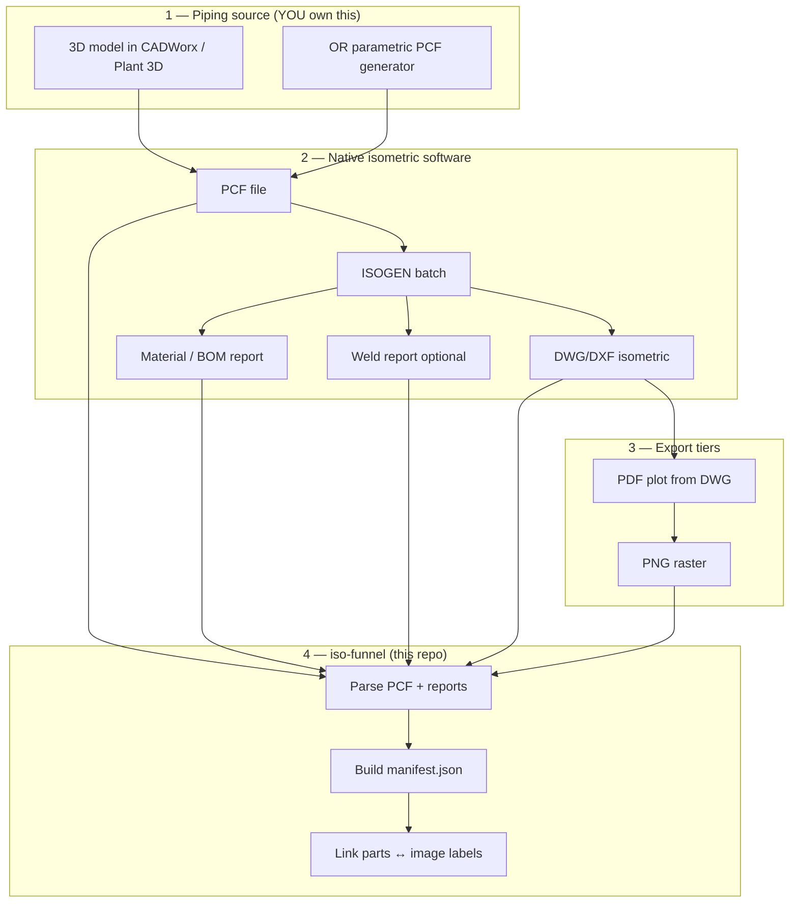

# Phase A — Native Software Pipeline (Revised)

## Why the ezdxf approach is not sufficient

The initial `synth-gen` prototype draws isometrics programmatically. Real project isometrics are **never authored that way**. They are produced by:

- **CADWorx Plant**, **AutoCAD Plant 3D**, **Smart 3D**, **PDMS**, etc. (3D model)
- → **PCF / IDF** export (structured piping data)
- → **ISOGEN** (isometric engine)
- → **DWG/DXF** + material reports + weld data
- → **PDF plot** + raster image

Training on ezdxf drawings will not generalize to production isometrics (table layout, fonts, symbols, callout style, spool breaks, dimensions).

**This document replaces the drawing-generation section of PLAN.md for Phase A.**

---

## Correct architecture



**Ground truth comes from the piping software (PCF + ISOGEN reports), not from our drawing code.**

---

## What each tier contains

| Tier | File(s) | Source | Training use |
|------|---------|--------|--------------|
| **T0** | `.pcf` | CAD export or `pcf-gen` | Component list, materials, 3D coords, item codes |
| **T0b** | `.mtc` / `.bom` / `.xls` | ISOGEN / ISOWorx material report | BOM: qty, description, material grade |
| **T0c** | `.wld` / weld `.xls` | ISOGEN / ISOWorx | Weld IDs, shop/field, linked parts |
| **T1** | `.dwg` / `.dxf` | ISOGEN output | Native vector; callout positions |
| **T2** | `.pdf` | DWG plot | Text-searchable export |
| **T3** | `.png` | PDF rasterize @ 150–300 DPI | **Model training input** |
| **Manifest** | `manifest.json` | `iso-funnel` | Links T0 data ↔ T3 image bboxes |

---

## Phase A revised — work packages

### A1 — Software setup (manual, one-time)

| Task | Tool |
|------|------|
| Install / confirm piping CAD | CADWorx Plant, Plant 3D, or similar |
| Confirm ISOGEN + I-Configure style | Your company iso style (BOM table, callouts) |
| Configure ISOGEN material report | Outputs `.mtc` or BOM xls per drawing |
| Optional: ISOWorx | Companion BOM/WELD xls per iso ([docs](https://support.ecedesign.com/support/solutions/articles/24000092556)) |
| Test one manual iso | One line → PCF → DWG → verify BOM report exists |

### A2 — Dummy piping line library

Create a **parameterized set of dummy lines** in the 3D model (or as PCF files):

| Variant | Purpose |
|---------|---------|
| Straight run + 2 elbows | Basic routing |
| Tee branch | Junction callouts |
| Reducer + flange + valve | Mixed components |
| Multi-spool line | Spool breaks |
| Small bore vs large bore | Size text variance |
| 20–50 unique topologies | Initial dataset |

**Option A — 3D in CADWorx / Plant 3D (recommended if you have the license)**

- Model each topology as a separate line number (`6-P-1001`, etc.)
- Batch with `ISOGENBATCH` or `-ISOGENBATCH` ([CADWorx help](https://docs.hexagonali.com/r/en-US/CADWorx-Plant/22/359091))

**Option B — Parametric PCF generator (scalable)**

- Build `pcf-gen` in this repo: outputs valid PCF per [Hexagon PCF Reference](https://docs.hexagonppm.com/r/en-US/PCF-Reference-Guide/Version-15/242663)
- Feed PCF folder to **ISOGEN-S** (folder watcher) or ISOGEN batch CLI
- ISOGEN produces **real** isometrics from PCF — same as your production workflow

### A3 — Batch export script (Windows)

A Windows batch / PowerShell + Python orchestrator (`iso-funnel`) that:

```
1. Drop PCF into ISOGEN input folder  (or trigger ISOGENBATCH from CAD)
2. Wait for DWG + material report
3. Plot DWG → PDF  (AutoCAD Core Console / ODA / your plot script)
4. Rasterize PDF → PNG  (Python: PyMuPDF / pdf2image)
5. Parse PCF + .mtc/.xls → structured BOM JSON
6. Write manifest.json linking all files
```

**Example output layout:**

```
data/native/v1/
├── index.jsonl
└── lines/
    └── 6-P-1001/
        ├── source.pcf
        ├── bom.mtc                    # or LineTag-BOM.xls
        ├── native.dwg
        ├── export.pdf
        ├── export_300dpi.png
        └── manifest.json
```

### A4 — Label linking (hardest step)

Map software part data to image regions:

| Label | Source | Image location |
|-------|--------|----------------|
| Item No | BOM report row / ISOGEN item index | BOM table `ITEM` column bbox |
| Description | PCF `DESCRIPTION` / report | BOM table `DESCRIPTION` column bbox |
| Part on drawing | ISOGEN component-ID ↔ item number | Callout balloon + arrow tip |

**Approaches (in order):**

1. **Parse DWG** — read `MULTILEADER`, text entities on BOM layer → exact coords (ezdxf read, not write)
2. **ISOGEN report columns** — some styles output item-index ↔ component-ID mapping
3. **Semi-auto QA tool** — visual overlay for human verification on first 50 drawings

### A5 — Domain randomization (on real isos)

Apply to T3 only (not to DWG):

- Re-plot PDF at different DPI
- Scan simulation (noise, skew, JPEG)
- Same manifest ground truth after geometric transforms

---

## What this repo builds vs what you run locally

| Component | Runs where | You need |
|-----------|------------|----------|
| **CADWorx / Plant 3D** | Your Windows PC | License |
| **ISOGEN + I-Configure** | Your Windows PC | License |
| **ISOGENBATCH** | CAD command line | Configured iso style |
| **`iso-funnel` CLI** | WinPython on your PC | This repo |
| **`pcf-gen`** (optional) | WinPython | ISOGEN to consume output |
| **Model training (Phase B)** | GPU machine | Dataset from A3 |

The repo does **not** replace ISOGEN. It orchestrates exports and builds training manifests.

---

## Revised Phase A deliverables

| ID | Deliverable | Owner |
|----|-------------|-------|
| A1 | One manual iso end-to-end (PCF → DWG → PDF → PNG) | You + ISOGEN |
| A2 | 20 dummy line topologies in CAD or PCF | You / `pcf-gen` |
| A3 | `iso-funnel run` batch script | This repo |
| A4 | PCF + BOM parser → `manifest.json` | This repo |
| A5 | DWG label reader for callout coords | This repo |
| A6 | 50-drawing smoke dataset with QA overlays | Joint |
| A7 | Domain randomization on PNG | This repo |

---

## PCF example (ground truth snippet)

From [Hexagon PCF Reference](https://docs.hexagonppm.com/r/en-US/PCF-Reference-Guide/Version-15/253225):

```
PIPE
    COMPONENT-IDENTIFIER 5
    END-POINT 132364.0 56421.0 11131.0 14
    END-POINT 132380.0 56421.0 11131.0 14
    MATERIAL-IDENTIFIER 2

MATERIALS
MATERIAL-IDENTIFIER 2
    ITEM-CODE N.A.-002
    DESCRIPTION 14" STD, A106 GR B, CC173
```

This `DESCRIPTION` is what the model must read from the image BOM table.

---

## CADWorx batch reference (if you use CADWorx)

```
Command: ISOGENBATCH  or  -ISOGENBATCH
Requires: I-Configure style pre-defined
Output:   DWG isometric per line number + PCF in project folder
Optional: ISOWorx → LineTag-BOM.xls + LineTag-WELD.xls per iso
```

Script example (`.scr` file for AutoCAD/CADWorx):

```
-ISOGENBATCH
All
No
No
```

---

## Status of `synth-gen` (ezdxf prototype)

Keep as **fallback / dev mock** only — useful for:

- Testing manifest schema
- Phase B model architecture experiments without ISOGEN license
- CI unit tests

**Do not use for production training data.**

---

## Open question — which software do you have?

The implementation path depends on your stack:

| If you have… | Recommended path |
|--------------|------------------|
| **CADWorx + ISOGEN** | 3D dummy lines → `ISOGENBATCH` → `iso-funnel` |
| **Plant 3D + ISOGEN** | Same with Plant production iso |
| **ISOGEN only (no CAD)** | Build `pcf-gen` → ISOGEN-S folder watch |
| **CADWorx + ISOWorx** | Above + automatic BOM/WELD xls |
| **No license (free only)** | See **[FREE_STACK.md](FREE_STACK.md)** — IsoAlgo + `pcf-gen` |
| **Other (BricsCAD, etc.)** | Tell us — adjust export steps |

**Please confirm your stack** so we can implement `iso-funnel` against the right batch commands and report formats.
